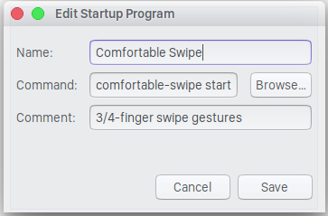

# Ubuntu-Comfortable-3-Finger-Swipe
Author: Rico Tiongson  

Comfortable 3-finger and 4-finger swipe gesture using Xdotool in native C++, for Ubuntu 16.04LTS and beyond. Makes use of Xdotool to simulate a keyboard shortcut via

## Installation
1. `sudo apt install libinput-dev libxdo-dev`
2. Tweak `src/comfortable-swipe.cpp` to fit keyboard shortcuts of your gestures
3. `bash install`

## How to Run
1. `comfortable-swipe-serve` =
2. Flick away!

## Optional: Add to Startup Applications
1. `gnome-session-properties`
2. Add

  